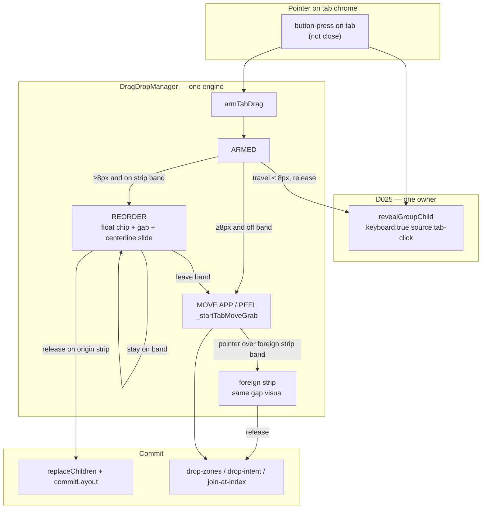
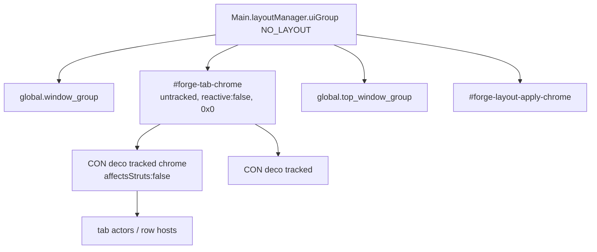
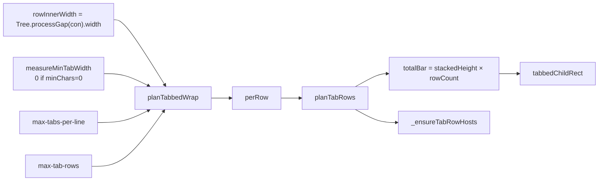

# Plan: Click-drag moving tabs

**Status:** design consensus — **PR1–PR5 shipped**; visual drag contract
**locked 2026-08-17** (Chrome float+gap; wrap-on 20; 2D multi-row)
**Priority:** P1 product chrome
**Created:** 2026-08-16
**Updated:** 2026-08-17
**Branch:** `master`
**Locks:** D018, D023–D026, D032, D039–D044; Tab D0; **Chrome live
reorder visual** (this plan § Product feeling + § Chrome live reorder)
**Supersedes (product next):** [forge-tab-chrome-drag](./forge-tab-chrome-drag.md)
TD1 remains the **commit** engine (`applyTabStripReorder` +
`replaceChildren`); this plan is pickability + wrap + 2D +
**Chrome-like live preview** (float tab + centerline gap).
**PR1 shipped:** [chrome layer](./completed/forge-tab-click-drag_pr1-chrome-layer.md).
**Reference video:** [chrome-tab-drag-reference.webm](./forge-tab-click-drag/chrome-tab-drag-reference.webm)
(source: operator Kooha of Google Chrome tabs, 2026-08-17).
**Do not start wrap-on** until the PR that ships 2D insert
(`min-tab-label-chars` schema stays 0 until then). Q1/Q2 locked
(wrap-on with 2D; `max-tab-rows` default 0 = unbounded).

### Session note (overwrite)

**2026-08-17 (orchestrator):** **PR5 done** —
[completed](./completed/forge-tab-click-drag_pr5-2d-wrap-default.md).
`tabStripInsertIndex2D` + peel union + schema default **20**. L0 **152**
orchestrator-recheck green. Nest multi-row smoke skipped (unit-proven).
**Next:** PR6 foreign-strip gap + join-at-index (later). No reshape
PR1/PR4/PR5. Host lock residual human.

---
---

# Click-drag moving tabs (reorder, peel, pickability, wrap)

| Field | Value |
| --- | --- |
| **Document** | Click-drag moving tabs |
| **Author** | Forge design (agent) |
| **Date** | 2026-08-16 (Q1/Q2 resolved 2026-08-17) |
| **Status** | Design consensus — Q1/Q2 resolved |
| **Audience** | Senior engineers who already know this tree |
| **Follows** | D018, D023–D026, D032, D039–D044; Tab D0 (2026-08-16) |
| **Not** | A reopen of R025 / R026 / R032 as unfixed bugs. Those
  shipped. This elevates the *failure class* and the missing
  mouse-first tab product to architecture. |

---

## Overview

Forge already has the pieces of a Chrome-like tab strip, split
across four systems that do not yet share one product contract:

1. **In-strip reorder (TD1, shipped).** Primary press on a tab
   arms `DragDropManager.armTabDrag`. Travel ≥
   `TAB_DRAG_THRESHOLD_PX` (8) *on the same group's strip*
   reorders via `tabStripInsertIndex` + `applyTabStripReorder` +
   `parent.replaceChildren` (D023). Percents travel. Open leaf
   and pin stay on the dragged child.
1. **Leave-strip peel (LX4, shipped).** Leaving the strip starts
   the existing grab-tile path (`_startTabMoveGrab` → Mutter
   `begin_grab_op` or synthetic `_handleGrabOpBegin`). Drop uses
   `drop-zones.js` / `drop-intent.js` (D024, D032, R022). There
   is no second DnD engine, and this design will not add one.
1. **Click / raise / restack (LF2, R025, R026, R032, ghost
   deco).** Tabs are St actors in `global.window_group`, siblings
   of `Meta.WindowActor`. Every `raise` / `focus` / `activate`
   can bury the strip. The repo has accumulated restack call
   sites to compensate. Tab D0 locked “no new click regression
   without a new repro.” The operator now wants the *class*
   closed: tabs must be first-class clickables by invariant, not
   by the next restack patch.
1. **Multi-row wrap (T9, shipped off).**
   `planTabRows` / `tabbedBarHeight` wrap by
   `max-tabs-per-line` (count). Default **0** = single row
   forever. The operator’s product is closer to Chrome-on-a-full
   strip: **equal-fill rows**, wrap when a filled tab would show
   fewer than ~20 characters of label, drag in **2D** across
   rows, peel only after leaving the **union of all rows**.

**Proposed direction.** Keep TD1 + LX4 as *the* gesture engine.
Extend the same `drag-drop.js` pures for 2D insert. Replace
count-only wrap with one readable-fill planner in
`tree-layout.js`. Move CON decorations out of `window_group`
sibling competition with Meta window actors onto a dedicated
**tab-chrome layer** in `uiGroup` (above `window_group`, below
`top_window_group`), with each **strip-sized** decoration
registered via `trackChrome({ affectsStruts: false })` so X11
stage input regions include the strip. Bind layer visibility to
`window_group.visible` (lock / overview / greeter). Pickability
no longer depends on raise/restack order.
`revealGroupChild` stays the only live show-in-group API
(D025).

North star: **Chrome’s live tab drag** (float chip under the
pointer, centerline sibling slides, gap = chip width) and
**2D strip** feel; Forge’s **equal-fill** settled layout (no
overflow chevron, no strip scroll). Peel does not create an
OS window — it is grab-tile + Forge drop zones, with
foreign-strip gap insert when the pointer is over another
group’s bar.

---

## Background and motivation

### What already works

| Gesture | Path | Status |
| --- | --- | --- |
| Keyboard swap / move | `swapPairs`, `window-swap-*`, `window-move-*` | Product |
| Click tab (no drag) | `Node._activateFromTab` →
  `wm.revealGroupChild({ keyboard: true, source: "tab-click" })` | LF2 + R025 + R026 |
| Drag along 1D strip | `tabStripInsertIndex` + `replaceChildren` | TD1 nest PASS |
| Drag off strip | `_startTabMoveGrab` → grab-tile | LX4 / TD1 |
| CENTER join | `mergeWindowsIntoGroup` (D024) | R019 shipped |
| Edge drop | slot-split target unit (D032) | Insert A / R028 |
| Empty-mon drop | leaf-only (R022) | R015 / R022 |
| Peel, no target | Model B wrap-in-slot (D032) | TD2 skip (Tab D0) |
| Apply overlay | dies at all-hard (D043) | not a tab bug |
| Groups | mon-local (D044) | shipped |

TD1 is the product **commit** path (`applyTabStripReorder` +
`replaceChildren`). It is not a prototype to replace. What it is
missing is Chrome-like **live** feel: the tab chip follows the
pointer, siblings **slide** and leave a **gap** (not an outline on
a neighbor), multi-row hit test, foreign-strip gap insert while
peeling, and a wrap model that matches the operator’s “readable
label” intent. Reference:
[chrome-tab-drag-reference.webm](./forge-tab-click-drag/chrome-tab-drag-reference.webm).

### Why click still cannot be trusted as architecture

`Node._createDecoration` parents the CON `St.BoxLayout` into
`global.window_group` (`lib/extension/tree.js`).
`DecorationManager._restackDecorationAboveGroup` then
`insert_child_above` that decoration over the topmost compositor
private of the CON’s tiled descendants.

That makes tab chrome a **stacking competitor** of
`Meta.WindowActor`. The compositor wins:

| Failure | Mechanism |
| --- | --- |
| Pre-LF2 | `insert_child_below(global focus)` — strip unpickable
  when focus is elsewhere |
| LF2 | `activate()` without `focus()` on X11; raise without
  restack; hover re-raise every ~16ms re-buried chrome |
| R025 | `reveal` raised a hidden tab still FLOAT / old-slot |
| R026 | layout pin treated the click as steal |
| R032 | ApplyLayout last raise + trailing `focus()` after
  `revealGroupChild` restack; Done-path `settleTabFocus`
  raise applied after the restack idle (Wayland) |
| Ghost deco | auto-exit-tabbed left a reactive actor over CSD |
| Overlay | correctly eats pointer until all-hard (D043) |

Each fix added a restack or a “don’t raise here” special case
(`SessionApi._restackTabDecorations` is explicitly restack-only;
keyboard `revealGroupChild` restacks *after* focus+activate).
The next `meta.raise()` from pin restore, D026 slot restore,
Chrome late activate, or a new call site reopens the class.

Tab D0 (2026-08-16) was correct *as a stop-the-bleeding rule*:
do not file another R0xx without a post-PASS host repro. It is
not a claim that sibling-Z is a sound pickability model.

### Why wrap and drag are now one design

T9 shipped a count cap and multi-row hosts
(`_ensureTabRowHosts`, vertical outer decoration when
`max-tabs-per-line >= 1`). Default 0 left daily driver on one
row. `tabStripInsertIndex` is **1D along one axis** (TABBED =
X, STACKED = Y). `_updateTabReorderFromPointer` feeds it every
sibling tab rect on that single axis.

On two rows, tab 0 and tab N share similar X and differ in Y.
A 1D X insert index will reorder as if they were one row. Peel
hit-test (`pointerOnTabStrip`) already uses the **AABB of all
tab rects** + 4px pad — that part is accidentally correct for
multi-row, and must stay the peel definition.

Operator product: wrap when a filled tab would show fewer than
~20 characters; fill each row equally; drag across rows as
same-group reorder until the pointer leaves the union of all
rows.

### Locked decisions this document will not re-litigate

- **D039–D043** — ApplyEpoch, in-slot hard, forest-match
  `Done.ok`, overlay dies at all-hard, belt deleted
- **D044** — TABBED/STACKED is mon-local. No spanning tab
  chrome. Mixed-mon members rehome to the CON MONITOR ancestor
  (keep group). Join across mons = move-then-join onto dest.
  Keyboard mon-move of one tab peels that leaf
- **D023** — child list only via Node methods (`replaceChildren`
  for reorder)
- **D024** — drop-intent / `dropChangesStructure` / CENTER join
  via `mergeWindowsIntoGroup`
- **D025** — `revealGroupChild` is the only live show-in-group
  API
- **D032** — edge drop slot-splits the target unit; peel with
  no target is Model B wrap-in-slot
- **D018** — open-leaf pin; explicit reveal of another child
  adopts the pin (R026)
- No second DnD engine. Leave-strip → existing
  `_startTabMoveGrab` / grab-tile / `drop-zones.js`
- Do not call `_layoutOp` / flatten
- Do not reintroduce belt, TILE-anywhere hard, mon-root
  PlaceNext, soft-enter chrome, spanning tab chrome
- Overlay remains all-hard. Tab click work is **after** overlay
  is gone
- STACKED remains a column of full-width labels. Multi-row wrap
  is a **TABBED strip** concern. STACKED drag already uses
  Y-axis `tabStripInsertIndex`
- Profiles stay data
- ApplyLayout / layout CLI are out of scope unless a contract
  forces a tiny hook (Done restack-without-raise already exists
  and stays)

---

## Goals and non-goals

### Goals

1. **Mouse-first in-group reorder** that feels like Chrome:
   pressed, 8px threshold, **floating dragged chip**, **gap +
   sibling slide** from centerline crossings, release commits
   sibling order into the gap. Keybinds remain.
1. **Leave strip-union = move app.** Same grab-tile path as
   titlebar while off every strip. When the pointer enters
   **another** group’s strip, that strip shows the same gap
   insert (not only a tile CENTER zone). Edge / empty-mon /
   wrap-in-slot otherwise unchanged.
1. **Durable pickability invariant** so “click does nothing
   until I click the body / another tile” cannot recur from
   raise/restack races.
1. **One wrap brain** for TABBED: equal-fill rows, wrap when a
   filled tab would be unreadable (~20 characters of label),
   drag in 2D, peel on union-exit. Content inset uses **total**
   multi-row bar height (`tabbedChildRect` — keep).
1. Extend named APIs. Test pures in unit tests. Nest (mon=1)
   for pointer-adjacent live; no XTEST. PR1 pickability is
   gated on **host X11**, not nest.

### Non-goals

- A second DnD engine, a decoration.js reorder helper, or a
  twin of `revealGroupChild`
- Chrome overflow chevron / strip scroll as the default product
- Creating a new OS window on peel
- STACKED wrap / STACKED product redesign
- Cross-mon spanning chrome (D044)
- FCC C2+ group reshape, C3 H/V split chrome, C4 CON move
- Changing ApplyLayout / slot machines / overlay lifetime
- `_layoutOp` flatten, belt, TILE-anywhere hard
- Replacing keybind swap/move
- Firefox-style pinned tabs
- Per-title wrap that reflows when a YouTube title changes
- Personal-layout product branches

---

## Proposed design

### Product feeling (locked)

**Reference (FIRM).** Operator video of Google Chrome:
[chrome-tab-drag-reference.webm](./forge-tab-click-drag/chrome-tab-drag-reference.webm).
Any implementer who has not watched it must watch before coding
reorder preview. The **outline-on-neighbor** CSS
(`.window-tabbed-tab-reorder-insert`) is **not** the product
preview. It is a TD1 scaffold to **delete** once float+gap
lands.

#### What the operator must see (same-strip REORDER)

Frame-by-frame contract (Chrome parity, Forge equal-fill):

1. **Press** on a tab body (not close): tab looks pressed/armed
   **and** the leaf reveals immediately (`clickFn` on
   `button-press-event`). Do not defer reveal until release.
1. **Travel < 8px** Euclidean: stay ARMED. Release = click only
   (no reorder, no peel).
1. **Travel ≥ 8px** while pointer is still inside the **strip
   band** (decoration height ± pad — see “modes” below):
   enter **REORDER**.
1. **Floating chip.** The dragged tab **leaves the layout flow
   and follows the pointer** (grab offset preserved: chip does
   not jump so the click point snaps to the chip corner). The
   real chip is elevated (slightly above siblings / slight
   shadow or active style) so it is obvious *this* is what is
   moving — like Chrome, not a ghost outline on a neighbor.
1. **Shrink while dragging.** As soon as REORDER (and while
   PEEL float is over a strip), the floating chip width is the
   **minimum tab width** for the current bar metrics
   (`measureMinTabWidth` / icon+close+min label — same floor
   the wrap planner uses when wrap is on; when wrap is off,
   use the same chrome floor the planner would use at
   `minChars` product default). Sibling layout during the
   gesture treats the gap as that min width. **After release**,
   `processTabbed` equal-fill redistributes as today — do not
   invent a second sizing brain for the settled strip.
1. **Gap.** Where the tab will land, the strip shows an empty
   slot whose **width equals the floating chip’s current
   width** (exact, not a 2px bar). Remaining tabs do **not**
   expand into that gap during the gesture (equal-fill is
   **post-commit only**).
1. **Centerline slide (FIRM, the clarity rule).** While the
   pointer stays in the strip band:
   - Track the floating chip’s **leading edge** in the drag
     axis: **right edge** when the chip is moving right,
     **left edge** when moving left (TABBED X). STACKED uses
     **bottom/top** edge on Y the same way.
   - When that leading edge **crosses the vertical (TABBED) /
     horizontal (STACKED) centerline** of a sibling tab that
     is still in the strip flow, that sibling **animates** to
     the other side of the gap. The gap moves with the
     crossing. One sibling at a time per crossing; no
     hysteresis that leaves “which side?” ambiguous.
   - After a slide, the gap is still exactly the chip width
     and sits where release would insert.
1. **Release on strip.** Chip drops into the gap (short ease
   optional). Commit: `applyTabStripReorder` +
   `group.replaceChildren` + `commitLayout("tab-strip-reorder")`
   + `settleTabFocus` on the dragged child only. Group stays
   TABBED/STACKED. Percents travel (do not
   `resetSiblingPercent`). Then equal-fill runs as normal
   layout.
1. **Cancel / destroy tab:** abort float, restore strip
   geometry, no `replaceChildren`.

**Why this replaces the outline marker.** Today’s painter puts
`.window-tabbed-tab-reorder-insert` on `kids[insertIndex]`.
That outlines a *neighbor*, so the operator cannot tell
“insert before this tab” vs “insert after,” and 1D mid-tab
math can flip either side of the same visual. Chrome never
outlines a stationary tab as the only cue — it **moves the
dragged tab** and **slides neighbors**, leaving an obvious
gap. That is the locked product.

#### Two gesture modes (strip band vs desk)

| Mode | Enter when | Visual | Commit |
| --- | --- | --- | --- |
| **REORDER** (in-group or foreign-strip) | After ≥8px, pointer **Y** (TABBED) / **X** (STACKED) is inside the **strip band**: strip rect ∪ pad (`TAB_STRIP_HIT_PAD_PX`, may add a small extra vertical pad named once if 4px feels tight — one constant). Multi-row: **union of all rows** of that group. | Floating min-width chip + gap + centerline slides on **that** group’s strip. No tile drop-zones. | `replaceChildren` at gap index (same group) or join/move into foreign group at gap index (see below). |
| **MOVE APP** (peel / grab-tile) | Pointer leaves every strip band (origin and any foreign). | Floating chip may continue or hand off to Mutter grab; **window** follows pointer as titlebar move. Tile drop-zones as today. | Existing `_startTabMoveGrab` → drop-zones / drop-intent (CENTER join, edge split, empty-mon, wrap-in-slot). |

**Re-entry.** If MOVE APP was entered and the pointer later
enters a strip band again **before** grab end:

- **Same origin group:** re-enter REORDER on that strip
  (float+gap). Clear tile drop-zones.
- **Foreign group strip:** REORDER-on-foreign — that strip
  opens a gap for this chip (wrap rows if the planner would
  wrap with one more child). Release commits insert into that
  group at the gap index (move-then-join / existing merge
  path; D044 mon-local still applies).

Once a **synthetic or Mutter grab** has fully taken over
window move, follow the existing grab end path; do not fight
Mutter mid-grab with strip REORDER. Prefer: peel starts only
when leaving the strip; if re-entering a strip mid-drag
**before** `begin_grab_op` succeeds, stay on Forge-owned
pointer tracking and paint foreign gap. If grab already
began, foreign strip gap is a **stretch goal in the same PR
series** only if grab motion can still hit-test strips
without a second DnD engine — escalate rather than invent one.

#### Like Chrome (locked checklist)

- Press → reveal + arm (not release-to-reveal).
- ≥8px on strip band → REORDER float+gap.
- Leave strip band → MOVE APP (grab-tile).
- Close control is never a drag handle.
- Multi-row same group: row1 → row2 is REORDER until pointer
  leaves the **union of all rows** + pad.

#### Unlike Chrome (locked)

- Settled tabs in a row **equal-fill** the row (`x_expand`).
  During drag, gap is min-chip width; after commit, equal-fill
  again. No overflow chevron / strip scroll as default —
  wrap instead.
- Peel does not undock an OS window; it is grab-tile + Forge
  drop zones (and foreign-strip gap when on a strip).
- D044: mon-local groups; no spanning chrome.

**STACKED.** Out of the wrap model. Column of full-width
labels. Drag axis is Y: float chip, gap height = chip height,
centerline is horizontal midline, siblings slide vertically.
Peel still grab-tile.

**CON-rep tabs.** Reorder still moves the CON unit
(`_resolveTabStripReorderContext`). Peel still grabs the
**representative Meta window**. No CON-as-drag-unit (FCC C4).

### Architecture at a glance



### 1. Tab chrome pickability (the architectural fix)

#### The invariant (I-TabPickable)

A TABBED/STACKED CON’s decoration is **first-class pickable**
iff all of the following hold. If any eligible clause is true
and a later clause is false, that is a regression of this
class — not a “click the body first” workaround.

1. `showtab-decoration-enabled` is on.
1. `con.isStackedOrTabbed()` (ghost-deco gate stays).
1. CON is on the active workspace
   (`_conOnActiveWorkspace` / `_decorationOnActiveWorkspace`).
1. That monitor has no covering maximize / fullscreen window
   (`_monitorHasCoveringMaxOrFullscreen`).
1. Apply overlay is **not** up. Overlay is a higher layer and
   correctly eats pointer until all-hard (D043 / Tab D0). A
   leftover `#forge-layout-apply-chrome` after `reason=all-hard`
   is an overlay bug, not a tab bug.
1. The CON decoration is a child of the **tab-chrome layer**
   (not a `window_group` sibling of `Meta.WindowActor`) **and**
   is **tracked chrome**:
   `Main.layoutManager.trackChrome(decoration, {
     affectsStruts: false, trackFullscreen: false,
     affectsInputRegion: true })` via idempotent
   `attachTabDecoration` (never re-`trackChrome` a live
   deco). Parenting alone is not pickable on X11 —
   `_updateRegions` builds `global.set_stage_input_region`
   from tracked actors only.
1. The tab-chrome **host** is untracked, `reactive: false`,
   `NO_LAYOUT`, not sized to the stage, and
   `visible === global.window_group.visible`.
1. Decoration is `reactive === true`, shown, and non-zero size.
   Tab children are `reactive === true`. Close control is
   reactive but is not a drag handle.
1. Decoration’s screen rect matches the strip
   (`_applyDecorationRect` output): full CON width × total bar
   height, at `tab-position` top or bottom.
1. A primary press on any tab pixel (except close) runs
   `_activateFromTab` → `revealGroupChild({ keyboard: true,
   source: "tab-click" })` without requiring a prior content
   click, other-tile click, or other-monitor click.

**What “first-class” means in the three focus cases**

| Desk state | Press on a tab |
| --- | --- |
| Open leaf already focused | Reveal is idempotent. Chrome stays
  pickable. No pin steal. No second structure commit. |
| Focus on another child of the same group | Reveal that child.
  Adopt live pin (R026). Reassert that child only (R025). |
| Focus on another tile or another monitor | Same reveal path
  (LF2: focus **and** activate). Chrome layer does not care
  which monitor holds keyboard focus. |

Hover (`_focusWindowUnderPointer`) must not re-raise the already
focused window (LF2 test stays). Hover must not change
`lastTabFocus`. After the layer move, a mistaken re-raise can
no longer bury chrome; keep the guard anyway so hover does not
fight Chrome/PWA late activate.

#### Why restack-after-raise cannot be the contract

`docs/DESIGN.md` § Raise / restack correctly refuses a unified
`raiseWindow()`. Raise is multi-path on purpose (fullscreen
float demote, `make_above`, Wayland transient pin). Tab chrome
pickability is **not** a raise-path problem. It is an **actor
parent** problem.

As long as decorations live in `window_group`:

1. `meta.raise()` / `focus()` / `activate()` reorder window
   actors.
1. Wayland often applies that reorder **after** our idle
   restack (R032 Done-path).
1. Every new raise site needs another restack, or a “don’t
   raise here” special case.

That is a band-aid stack. The invariant above deletes the
competition.

#### Tab-chrome layer

Introduce one host, name `#forge-tab-chrome`, owned by
`DecorationManager`. Verified against GNOME Shell 46
`js/ui/layout.js` (upstream `gnome-46`):

- `uiGroup` is `NO_LAYOUT` and is the parent of
  `global.window_group` and `global.top_window_group`.
- `addChrome(actor)` does `uiGroup.add_child` then
  `set_child_below_sibling(actor, top_window_group)` and
  **tracks** the actor.
- Raw `uiGroup.add_child()` appends at the **top** of
  `uiGroup` (above modal dialogs / screenshot UI) unless
  restacked immediately.
- `_updateRegions()` builds the X11 stage input region from
  **tracked** chrome only
  (`affectsInputRegion && get_paint_visibility()`).
  `wantsInputRegion` is false on Wayland
  (`!Meta.is_wayland_compositor()`). Nest will not catch an
  untracked X11 miss. Host `black` is GNOME 46 X11.
- `_updateVisibility()` sets
  `window_group.visible = sessionMode.hasWindows && !overview`
  (also hides `top_window_group`). Lock / greeter
  (`!hasWindows`) hide `window_group`. Forge **keeps the tree
  on lock** (`docs/dev/architecture.md`); tab labels are live
  titles. An un-bound layer is a privacy leak.

##### Attach algorithm (lock)

1. **Host.** `St.Widget` named `forge-tab-chrome`. Flags:
   `Clutter.ActorFlags.NO_LAYOUT`, `reactive: false`,
   `clip_to_allocation: false` (children paint outside a 0×0
   allocation). Do **not** size it to the stage. Do **not**
   `addChrome` / `trackChrome` the host. A tracked full-stage
   host is an overlay-class click thief.
1. **Parent.** `Main.layoutManager.uiGroup.add_child(layer)`
   then immediately
   `set_child_above_sibling(layer, global.window_group)` **and**
   `set_child_below_sibling(layer, global.top_window_group)`.
   Never leave a bare `add_child` at the end of `uiGroup`.
1. **Each CON decoration (strip-sized only).**
   `attachTabDecoration(con)` is **idempotent** (Dfocus /
   Done sync / `_showAndRestackTabDecoration` call it every
   time). GNOME 46 `_trackActor` **throws**
   (`trying to re-track existing chrome actor`). Parent
   change does **not** untrack.

   Algorithm:
   1. Reparent onto the layer if `get_parent() !== layer`.
   1. `trackChrome` **only if** this decoration is not
      already tracked. Own that fact on
      `DecorationManager` (`WeakSet` of tracked decos).
      Do not read `layoutManager._trackedActors` /
      `_findActor`.
   1. First track:
      `Main.layoutManager.trackChrome(decoration, {
        affectsStruts: false,
        trackFullscreen: false,
        affectsInputRegion: true,
      })` then add to the WeakSet.

   `untrackChrome(decoration)` + WeakSet delete in
   `_destroyDecoration` and orphan sweep (destroy also
   auto-untracks). Unit: `attachTabDecoration` twice on
   the same live deco does not throw; second call is a
   no-op track.
1. **Never track the host.** Never `affectsStruts: true` (e2e
   overlay comments already warn that `addChrome` struts
   perturb tiling — that is an argument for
   `affectsStruts: false` on children, not for skipping
   `trackChrome`).
1. **Z re-assert.** Layer stays **parked**:
   `set_child_above_sibling(layer, window_group)` and
   `set_child_below_sibling(layer, top_window_group)` only.
   On apply-overlay show, restack **the overlay above the
   layer**: `set_child_above_sibling(overlay, layer)`.
   **Never** `set_child_below_sibling(layer, overlay)` —
   overlay is a late `uiGroup.add_child` (already above
   `top_window_group`); lifting the layer to sit just under
   it would put strips above panel / Overview /
   `top_window_group` (Alternative I). Overlay is created
   lazily on first apply and persisted.
1. **Visibility owner.** One bind:
   `layer.visible === global.window_group.visible`.
   Connect `window_group` `notify::visible` (covers Overview,
   lock, greeter, `!sessionMode.hasWindows`). Overview
   showing/hiding is backup only. Also hide on `disable()`
   and showing-desktop (existing
   `updateDecorationLayout` early-out stays). Do not
   implement “hide on Overview” as the only path.



**Ownership**

- `DecorationManager.ensureTabChromeLayer()` on enable.
- `Node._createDecoration` **builds** the `St.BoxLayout`
  (`window-tabbed-bg`, `reactive: true`). It must **not**
  `window_group.add_child`. It calls
  `decorationManager.attachTabDecoration(con)` (idempotent
  reparent + track-if-needed).
- `_showAndRestackTabDecoration` calls
  `attachTabDecoration` (self-heal). No bare second
  `trackChrome`.
- Layer `reactive: false`. Children stay reactive.

**Teardown (PR1 must hit every `window_group` assumption)**

| Site | Today | After PR1 |
| --- | --- | --- |
| `Utils._disableDecorations` | Destroys
  `window_group` children with `type != null` | Also destroy
  layer children; `untrackChrome`; destroy the layer |
| `DecorationManager._sweepOrphanDecorations` | Walks
  `window_group` for `type === "forge-deco"` | Walk the
  **layer**; untrack + destroy orphans |
| `_restackDecorationAboveGroup` | Early-return unless
  `window_group.contains(deco)`; `insert_child_above` a
  window actor | Rewrite as attach + sibling-order on the
  layer. **Delete** `insert_child_above` vs window actors |
| `WindowManager.disable` | `_disableDecorations()` then
  drop tree | Destroy layer **before** tree drop |
| `Tree.reload` | `_disableDecorations()` | Same helper,
  now layer-aware; recreate layer on next render |
| `_createDecoration` `contains()` guard | Tests
  `window_group` | Tests the layer |

**What happens to `_restackDecorationAboveGroup`**

It is no longer the pickability mechanism. Body becomes:

1. `attachTabDecoration` (idempotent parent + track-if-needed).
1. Optional chrome-sibling order (strips do not overlap under
   D044).

Existing `bug-tab-click-activate` tests that assert deco index
in `window_group` must assert: deco **not** in `window_group`;
parent is the layer; deco is tracked; after simulated
raise/focus/activate the strip still meets I-TabPickable.

**What happens to R032 Done restack**

`_scheduleTabStripRestack` / `_restackTabDecorations` stay as
**geometry / visibility / trackChrome sync** after the last
ApplyLayout raise — **still no second raise**.

**Coordinate space**

`uiGroup` and `window_group` are both children of the same
`NO_LAYOUT` `uiGroup` in GNOME 46. Parent-drift is not the
scale bug. Keep `_applyDecorationRect` `set_position` /
`set_size` from `processGap` + `decorationLayout` (same
physical/stage pixels as today). Wrap metrics must share that
space (see §4).

**Always-on-top floats**

Layer sits above `window_group` and **below**
`top_window_group`. Do not use `addTopChrome`. A
`make_above` FLOAT that overlaps the bar keeps those pixels.
Acceptable (strip is the bar only).

**Lock / session / overview**

Forge keeps the tree on lock. Layer visibility is
`window_group.visible`, not a hand-rolled Overview-only hide.
Ghost-deco tests must assert the layer is hidden whenever
`window_group` is.

#### Event ownership

| Actor | `reactive` | Events |
| --- | --- | --- |
| Tab `St.BoxLayout` (`.window-tabbed-tab`) | true | Primary
  **press**: `clickFn()` + `armTabDrag`, `EVENT_STOP`. Middle
  press: delete. Motion / release: forward to
  `noteTabDragMotion` / `finishTabDragRelease` when stage
  capture is missing. |
| Close `St.Button` | true | Primary/middle press: `delete` +
  `EVENT_STOP`. Never arm drag. |
| Icon / title `St.Button` | true | `clicked` still calls
  `clickFn` (redundant with press; keep for keyboard/a11y). |
| Row host (`_forgeTabRow`) | true | No extra handler. Children
  receive events. |
| CON decoration | true | No extra handler. Needed so a press
  on the 1px margin between tabs still belongs to the strip
  (peel AABB), not the window. |
| Tab-chrome layer | **false** | Must not capture outside
  children. |
| Apply overlay | true | Eats everything until all-hard. |
| Stage | capture while `_tabDrag` is armed | Already
  `captured-event` in `armTabDrag` so motion survives leaving
  the tab actor. Keep. `EVENT_PROPAGATE`. |

Do not attach click handlers on the layer. Do not move press
handling into `decoration.js`.

#### Click vs drag state machine

Already implemented in `armTabDrag` / `noteTabDragMotion` /
`finishTabDragRelease`. **This is the product machine.** Lock
it; extend hit-test only.

```text
press (tab, not close)
  → reveal immediately (clickFn / _activateFromTab)
  → armTabDrag (+ pressed class)
  → ARMED

ARMED + motion < 8px
  → stay ARMED

ARMED + release
  → disarm; no replaceChildren; no grab; no float

ARMED + motion ≥ 8px + pointer in strip band (origin)
  → REORDER
  → detach visual chip; shrink to min width; show gap
  → on motion: float chip to pointer (grab offset)
               recompute gap via centerline pure
               animate siblings that must slide
  → on release: applyTabStripReorder + replaceChildren
               + commitLayout("tab-strip-reorder")
               + settleTabFocus(dragged child) only
               + destroy float; equal-fill via processTabbed

ARMED or REORDER + pointer leaves every strip band
  → clear strip gap / float ownership handoff
  → _startTabMoveGrab
  → MOVE APP / PEEL (Mutter grab or synthetic)
  → drop-zones / drop-intent from here
  → if pointer re-enters a strip band *before* grab owns
    motion: prefer foreign/origin gap REORDER (see Product
    feeling); do not invent a second DnD engine

destroy tab / cancelTabDrag
  → destroy float; restore sibling geometry; disarm;
    if synthetic peel started, end grab
```

Threshold stays `TAB_DRAG_THRESHOLD_PX = 8` (Euclidean). Do
not add a separate X-only / Y-only threshold.

**Pressed visual.** One owner: `DragDropManager`.
`armTabDrag` adds `window-tabbed-tab-pressed` on the armed
tab actor. REORDER may promote the same actor (or a clone) to
the float chip and keep pressed/active styling. `_disarmTabDrag`
and successful commit clear pressed. Do **not** add/clear in
`clickFn`. Reveal already applies `window-tabbed-tab-active`.

#### One reveal sequence, one owner

Do not add a second activate path. `_activateFromTab` stays a
thin caller of `revealGroupChild`.

Locked order (`action-pipeline.js` `revealGroupChild`, already
documented in `docs/dev/actions.md` and `contracts.md`):

1. Write `parent.lastTabFocus = meta` (open leaf, not kbd).
1. If a layout pin is live and this child is different, **adopt**
   the pin (R026). Do not start a pin when none is live.
1. `reassertNodeToSlot(node)` unless `zoomMode` (R025). Never
   reassert from `afterFocus`.
1. `meta.raise()`.
1. `settleTabFocus` = F + Dfocus + B (`updateTabbedFocus` /
   `updateStackedFocus` + `updateDecorationLayout({ scope:
   "focus" })` + borders). Unfreeze if `_freezeRender`.
1. If `keyboard: true` (tab click, key, DBus): `focus` then
   `activate` (LF2).
1. `afterFocus` = F + Dfocus + B + P + A. **Restack / chrome
   sync last.** No trailing `focus()` after this (R032).

Tab click uses `keyboard: true` because it is an explicit
user intent to take desk focus, even though the entry is a
pointer. That is already the code and the LF2 contract.

**Forbidden after this design**

- `parent.lastTabFocus =` + `raise()` in a new file
- Trailing `focus()` after Dfocus
- Done-path `settleTabFocus` raise
- Reassert of siblings / other monitors from `afterFocus`
- Parenting a CON decoration into `window_group`
- `trackChrome` / `addChrome` on the full-stage host
- `addChrome(..., { affectsStruts: true })` on strips
- Leaving the layer visible when `window_group` is hidden

### 2. In-strip reorder (TD1 commits; Chrome live is the preview)

TD1 stays the **tree commit** engine
(`tabStripInsertIndex` / `applyTabStripReorder` /
`replaceChildren`). The **preview** is no longer “outline a
neighbor.” Preview is Chrome live reorder (float + gap +
centerline slide). Tree order updates **on release** (or when
a foreign-strip join commits) — not on every centerline cross
(avoids thrash / pin races). Visual order during the gesture
tracks the pure’s gap index.

| Gap | Today (TD1) | This design |
| --- | --- | --- |
| Insert math | 1D X (TABBED) / 1D Y (STACKED) via
  **pointer mid-tab** | **Centerline pure** driven by
  **floating chip edges** (see below). TABBED also gains
  **2D** row pick; STACKED stays 1D Y |
| Peel / mode region | AABB of tab rects + 4px | **Strip band**
  = AABB of tab rects ∪ decoration + pad. Explicitly union of
  all rows. Inside band = REORDER; outside = MOVE APP |
| Preview | `.window-tabbed-tab-reorder-insert` on
  `kids[insertIndex]` (ambiguous before/after) | **Delete**
  as product UI. Float chip + gap spacer + animated sibling
  shifts. Optional CSS: float elevation only |
| Pressed | Active class only | Pressed class on arm; float
  keeps active/pressed look |
| Live slide | None (marker only) | **Required.** Siblings
  ease-translate when centerline crosses; gap width =
  chip width (min while dragging) |
| Dragged size | Full equal-fill width | **Min tab width** for
  the gesture; post-commit equal-fill redistributes |
| Multi-row hosts | `max-tabs-per-line >= 1` | Also when
  readable-fill wrap produces `rowCount > 1` |
| Foreign strip | Peel only → tile zones | Strip band of
  **another** group → same gap insert; release joins at index |

#### Chrome live reorder (implementation contract)

**Ownership.** `DragDropManager` owns gesture state, float
actor lifecycle, gap index, and commit. Do not put float
ownership in `decoration.js` or a second manager.
`processTabbed` remains the only settled layout brain.

**Float actor**

1. On REORDER enter: capture grab offset
   (`pointer - tabOrigin`).
1. Prefer **reparenting the existing tab actor** onto the
   tab-chrome layer (or a drag sublayer under it) and
   `set_position` in stage coords each motion. Clone only if
   reparent breaks St allocation badly — one approach, not
   both.
1. Hide or zero the in-strip slot for the dragged child
   (spacer / collapsed allocation) so the strip does not
   paint two copies.
1. Chip width → min tab width (see Product feeling). Height
   stays bar row height.
1. Z: float above other tabs on the layer; still below
   `top_window_group` and apply overlay.
1. On disarm/commit: reparent back / destroy clone; clear
   spacers; clear transforms.

**Centerline pure (new, same module as insert math)**

```js
// lib/extension/drag-drop.js
export function tabStripGapFromFloatingChip({
  tabs,          // strip-flow rects in child order, excluding
                 // the dragged slot (or with dragged marked skip)
  chip,          // { x, y, width, height } stage rect of float
  axis,          // "x" | "y"
  dragDirection, // -1 | 0 | 1 along axis (from last motion)
} = {}) {
  // returns { index } // insert-before in 0..n for applyTabStripReorder
}
```

**Algorithm (lock)**

1. Build strip-flow list: every sibling **except** the dragged
   unit, in **current visual order** (starts as childNodes
   order minus dragged; updates only when a slide commits
   visually — or equivalently always derive from last gap
   index). Each entry has a layout rect **as if the gap were
   already reserved** (width/height of chip on the drag axis).
1. **Leading edge:** if `dragDirection ≥ 0` (or 0 with last
   non-zero ≥ 0), leading = chip’s max edge on axis; else
   leading = chip’s min edge.
1. Walk strip-flow tabs; for each, `center = min + size/2` on
   axis. Gap index is the first tab whose center is **strictly
   after** the leading edge when moving positive, and
   symmetrically when moving negative — equivalent to:
   insert before the first tab whose center the leading edge
   has crossed past in the drag direction. Ends: leading
   before all centers → index 0; after all → index n.
1. Map gap index back to **child-list insert-before**
   including the dragged node’s fromIndex
   (`applyTabStripReorder` already accounts for remove-then-
   insert). Unit-test this mapping hard.
1. **Do not** use “outline kids[insertIndex]” as the
   decision UI. Pointer mid-tab (`tabStripInsertIndex` alone)
   may remain a **subroutine** for 2D row pick (which row
   contains pointer.y) but **within a row** the gap index
   comes from the chip edge + centers, not from pointer X
   alone.

**Worked example (TABBED, three equal tabs A B C, drag B)**

| Chip motion | Leading edge | Centers | Gap / visual order |
| --- | --- | --- | --- |
| Still over B’s home | (armed) | — | gap at B’s slot; float over it |
| Move right; chip right edge passes C center | → | C slides left into old gap; gap now after C | A C _ _  float(B) |
| Move left; chip left edge passes C center again | ← | C slides right; gap between A and C | A _ _ C  float(B) |
| Release | — | — | `replaceChildren` to match gap; equal-fill |

**Sibling animation**

- When gap index changes, siblings that must change visual
  slot ease their translation (or allocation) over a short
  duration (~120–180ms, one named constant). Do not block
  pointer sampling on the animation.
- Gap spacer is always chip-sized (min width while dragging).
- No tile drop-zone paint during REORDER.

**Commit path (unchanged tree APIs)**

```
gapIndex → applyTabStripReorder(kids, fromIndex, gapIndex)
        → group.replaceChildren(next)
        → commitLayout("tab-strip-reorder", { force: true })
        → settleTabFocus(dragged)
```

Percents travel. Open leaf and pin stay on the dragged child.

#### 2D row pick + centerline gap (TABBED multi-row)

`tabStripInsertIndex` remains useful as a **row-local helper**
only where pointer mid-slot is still correct (STACKED Y can
use centerline pure alone). TABBED multi-row needs:

1. **Which row** holds the pointer (or nearest row) — 2D
   clustering.
1. **Where in that row** the gap sits — **centerline pure**
   on the floating chip, not “outline neighbor.”

```js
// lib/extension/drag-drop.js
export function tabStripInsertIndex2D({
  tabs, pointer, chip, dragDirection,
} = {}) {
  // tabs: one entry per childNodes slot (never compact).
  // Missing actor → placeholder inheriting sibling / deco Y.
  // returns { index }  // insert-before in 0..n (child-list)
  // No paint: "before"|"after" — gap UI makes that moot.
}
```

**Algorithm (lock)**

1. **Length.** `n = tabs.length`. If `n === 0`, return
   `{ index: 0 }`.
1. **Placeholders (child-list alignment).** Walk `tabs` in
   **childNodes order**. Do not drop slots. A missing /
   zero-size rect is a placeholder: copy the previous
   sibling’s `{ y, height }`. The **first** slot has no
   previous sibling: inherit the **next real** (non-placeholder)
   sibling’s `{ y, height }`; if none, use the **decoration
   rect**. Never `{ y: 0, height: 1 }` — with
   `tab-position: bottom` (or any strip whose real Y ≫ 0)
   that fake band steals nearest-row inserts. Width may stay
   1px. Today’s 1D path inserts
   `{ x: prev.x+w, y: 0, width: 1, height: 1 }` — that
   `y: 0` is exactly the fake-band bug. The inherit-Y rule
   is mandatory.
1. **Cluster rows (sort + greedy bucket, not pairwise).**
   Sort slot indices by `y` ascending (stable: original
   index on ties). Greedy-bucket: start a row with the next
   unused slot; a later slot joins that row iff its Y
   interval overlaps the row’s running `[minY, maxY]` by
   more than half the **smaller** of (slot height, row band
   height). Pairwise overlap is not transitive; do not use
   it as the row algorithm. Equal-height T9 rows bucket
   correctly after the Y sort.
1. **Order rows** by each row’s `minY` (top → bottom).
1. **Pick row.** The row whose Y band contains `pointer.y`
   (or chip center Y). If none, the nearest row by Y distance
   (inter-row margin reorders, not peels).
1. **Row-local gap.**
   `rowLocal = tabStripGapFromFloatingChip({ tabs: rowSlots,
   chip, axis: "x", dragDirection })` — `0..row.length`.
1. **Global map (child-list, not compacted).**
   `index = Σ(slotCount of rows strictly above) + rowLocal`.
   `Σ` uses **child-list slot counts** (placeholders
   included). `index` is in `0..n`.
1. **No paint discriminant.** “After last of row 1” vs
   “before first of row 2” is the **same** child-list index
   when rows are compact; the **gap** sits at the end of row
   1 or start of row 2 based on which row was picked. Visual
   gap follows the picked row.

**Who calls 2D.** TABBED → always `tabStripInsertIndex2D`
(with chip). STACKED → `tabStripGapFromFloatingChip({ axis:
"y" })` only. Never “call 2D when more than one Y-band
exists” — STACKED *is* a column of Y-bands.

Unit table (required): two rows; chip on row 2; between rows
(nearest); after last of row 1 vs before first of row 2 (same
index, different row pick); centerline crosses mid-sibling;
missing-tab placeholder stays on sibling Y band; missing
**first** slot inherits next real sibling Y (else decoration
rect), not `y: 0`; STACKED fixture does not call 2D.

`applyTabStripReorder` is unchanged (1D child-list splice).
Commit path is unchanged: `group.replaceChildren(next)` +
`commitLayout("tab-strip-reorder", { force: true })` +
`settleTabFocus` on the dragged unit.

After commit, `processTabbed` replans rows from the new order.
Row membership can change; row **count** does not change unless
the CON width or child count changed.

#### Peel region (multi-row)

`pointerOnTabStrip` already computes the AABB of supplied rects
+ `TAB_STRIP_HIT_PAD_PX` (4). That AABB includes the inter-row
gap. **Lock this as the peel definition.**

`_tabDragPointerOnStrip` should pass:

1. All sibling tab actor rects, and
1. The decoration actor rect if present

and treat on-strip as `pointerOnTabStrip` of that union.
Equal-fill means there is no unused last-row slot; the
decoration still spans full CON width so 1px tab margins
and the bar background stay on-strip.

Do not peel when crossing from row 1 to row 2. Do not introduce
a second pad constant unless nest proves 4px is too tight at
the outer edge; if so, raise `TAB_STRIP_HIT_PAD_PX` in one
place (it is already the named pad).

Once MOVE APP / PEEL starts, tile drop-zones appear. Origin
strip gap/float hand off as specified under Product feeling.
If the pointer is over a **foreign** strip band, prefer foreign
gap REORDER visual over tile zones (see §3). Do not invent a
second DnD engine — extend hit-test and commit on the existing
grab path where possible; escalate if Mutter grab forbids it.

#### Preview CSS

| Class | Role after this design |
| --- | --- |
| `.window-tabbed-tab-pressed` | Armed / floating chip affordance |
| `.window-tabbed-tab-dragging` (new, optional) | Elevation / shadow on the float chip only |
| `.window-tabbed-tab-reorder-insert` | **Remove** as product UI when float+gap ships. May remain briefly as dead CSS until cleanup PR |
| `.window-tabbed-tab-reorder-insert-after` | **Do not add** — superseded by gap |

Do not paint tile drop-zones during origin-strip REORDER.

### 3. Relocate = existing window-move path (+ foreign strip gap)

Leave-strip band is `_startTabMoveGrab` (MOVE APP):

1. `raise` + `focus` + `activate` the Meta window so grab begin
   matches `trackCurrentMonWs`.
1. `begin_grab_op(MOVING_UNCONSTRAINED)` if it returns
   **explicit** `true`; else synthetic
   `_beginSyntheticTabMove` → `_handleGrabOpBegin`.
1. Motion: `_handleMoving` → `moveWindowToPointer` →
   `buildDropZones` / `hitTestDropZone`.
1. End: `_handleGrabOpEnd` → `dropChangesStructure` /
   `mergeWindowsIntoGroup` / `slotSplitForInsert` /
   `_commitEmptyMonitorDrop` / wrap-in-slot.

**Foreign strip gap (product, same series).** When the pointer
is inside another TABBED/STACKED group’s strip band during
MOVE APP (or Forge-owned tracking before grab owns motion):

1. Hide or de-emphasize tile drop-zones for that hover.
1. Paint the **same** float chip + **gap** on the **foreign**
   strip using `tabStripGapFromFloatingChip` /
   `tabStripInsertIndex2D` against that group’s children (chip
   min width; wrap planner may open a new row if adding one
   child would wrap — visual may show the gap on the last row
   or a new row host; settled wrap is `processTabbed` after
   join).
1. On release over foreign strip: commit **insert at gap
   index** into that group (move-then-join if needed; D044
   mon-local: cross-mon = move onto dest mon first, then join).
   Prefer extending `mergeWindowsIntoGroup` / drop-intent with
   an **insert index** rather than always appending then
   reordering.
1. On release over tile CENTER (not strip): existing join
   behavior (append / merge as today).
1. Edge / empty-mon / no-target: unchanged D032 / R022.

D044 still applies: CENTER join across mons is move-then-join
onto **dest**. Empty-mon is leaf-only. Mixed-mon groups are a
defect and normalize to the CON MONITOR ancestor (keep group) —
peel does not auto-peel siblings.

`dropChangesStructure` must not treat same-strip reorder as a
drop (reorder never enters this function). Do not add
`_isNoOpDrop`.

### 4. Multi-row wrap (one brain)

#### What T9 shipped

```142:162:lib/extension/tree-layout.js
export function planTabRows(count, maxPerLine) {
  // maxPerLine <= 0 → one unlimited row
  // maxPerLine >= 1 → chunks of N indices
}
export function tabbedBarHeight(rowHeight, count, maxPerLine) {
  // rowCount × rowHeight
}
```

`processTabbed` uses that count cap, builds `_tabRowHosts` when
`maxPerLine >= 1`, and insets content with **total** bar height
via `tabbedChildRect`. STACKED uses `stackedChildRect` (N ×
row height) and is not this wrap model.

Default `max-tabs-per-line = 0` means **never wrap**. That is
the wrong product default for this design.

#### Single product rule (readable-fill)

Wrap is driven by **minimum readable label slot**, not by a
count that the user has to guess.

**20 what?** 20 **characters of the tab label slot**. Locked
metric (not an open question): cached font advance × N, **not**
live-title Pango, **not** a raw px key.

Adapter name: `measureMinTabWidth({ minChars, dpi, fontDesc
})` — lives next to the planner’s call site in
`Tree.processTabbed` (tree thin-wrap). Pango/St stay out of
`tree-layout.js`.

```
// measureMinTabWidth
if (minChars === 0) return 0;          // width wrap OFF
minLabelPx = minChars × avgGlyphPx
minTabPx   = iconSlot + closeSlot + chromePad + minLabelPx
```

- `minChars === 0` ⇒ **`minTabWidth = 0`**. Do **not** pass
  a chrome-only floor (~70px). Planner step 2 then sets
  `fit = n` → one row unless `max-tabs-per-line ≥ 1`.
  Unit: `minChars=0, maxPerLine=0, rowInnerWidth=200` →
  `rowCount === 1`.
- `avgGlyphPx` = average advance of `minChars` copies of
  `"0"` in the tab **title** font. Cache key
  `(font-desc, Utils.dpi(), minChars)`. Invalidate on
  `css-updated`, `stacked-tab-bar-height`, dpi change.
- Icon / close / pad are measured in the **same physical
  space** as `rowInnerWidth`. Icon is logical 24
  (`create_icon_texture(24)`); convert with `Utils.dpi()`
  (same as `stackedBarHeight()`). Do not mix logical chrome
  with physical `processGap` width (scale=2 on `black`
  would mis-wrap).

**Why not Pango of the live title?** A YouTube / Grok title
change would reflow the strip. Wrap is **slot** readability
under equal-fill (Chrome’s min tab width, in operator
language).

**Why not a raw px min-width setting?** It would not track
font / dpi / bar height.

#### Planner API (extend `tree-layout.js`)

Keep `planTabRows(count, maxPerLine)` as the chunker. Add:

```js
export function planTabbedWrap({
  count,
  rowInnerWidth, // Tree.processGap(con).width (gap-aware)
  minTabWidth,   // measureMinTabWidth; 0 = width wrap off
  maxPerLine,    // 0 = no count cap
  maxRows,       // 0 = unbounded (product default)
} = {}) {
  // returns { rows, rowCount, perRow, capped }
}

/** @returns {number} 0 when minChars === 0 (do not pass chrome floor). */
export function minTabWidthFromChars(minChars, avgGlyphPx, chromePx) { /* pure */ }
```

**Pixel source (lock).**
`rowInnerWidth = this.processGap(con).width` — the **Tree
wrapper** (`tree.js`), which is
`TreeLayout.processGap(con, this.extWm.calculateGaps(con))`.
Same start rect as `_applyDecorationRect`. Do **not** call
the two-arg pure with one argument: `gap` is `undefined`,
`nodeWidth > gap * 2` is false, and it returns
`node.rect.width` — the source this paragraph forbids.
Do **not** use `node.rect.width`, `decoration.get_width()`
after allocate, or `adjustWidth`
(border/gap/`DECORATION_ADJUST_FACTOR`). Half-tiles
(~900 / 210) sit on a `floor` boundary; mixed sources flip
4 vs 5.

**Algorithm (lock)**

1. `n = max(0, count)`. If `n === 0`, empty.
1. If `minTabWidth > 0`:
   `fit = max(1, floor(rowInnerWidth / minTabWidth))`.
   Else `fit = n` (width wrap off — includes `minChars=0`).
1. If `maxPerLine >= 1`, `perRow = min(fit, maxPerLine)`; else
   `perRow = fit`.
1. `rows = planTabRows(n, perRow)` (`perRow >= 1` here).
1. If `maxRows >= 1` and `rowCount > maxRows`:
   `perRow = ceil(n / maxRows)`, re-chunk, set `capped: true`.
   Tabs **shrink below** the 20-char slot and **ellipsize**.
   Do **not** overflow-scroll. Product default `maxRows = 0`
   skips this clamp (unbounded wrap).
1. **Bar height.** `processTabbed` uses
   `totalBar = params.stackedHeight * plan.rowCount`.
   It must **not** call
   `tabbedBarHeight(count, max-tabs-per-line)` (that re-chunks
   from the raw count cap and ignores a row-cap shrink).
   Keep `tabbedBarHeight(rowHeight, count, maxPerLine)` as a
   T9 test helper or thin `rowHeight * rowCount`; it is not
   the product bar path.

Equal-fill is unchanged: each row’s tabs `x_expand`. A last
row with fewer tabs gets **wider** tabs. No ghost slot.

If `rowInnerWidth < minTabWidth` and `minTabWidth > 0`,
`fit = 1`: one tab per row. With default `maxRows = 0` that
continues unbounded; a user-set `maxRows` then shrinks.

`processTabbed` uses `plan.rowCount > 1` (not
`maxPerLine >= 1`) to decide vertical outer + row hosts.

**Short tiles.** `planTabbedWrap` does not look at remaining
content height. Default `max-tab-rows = 0` (unbounded) means
a large group on a ~200px TILE can grow a tall bar and eat
the pane. Accept that. Escape: `max-tab-rows=1` or wrap keys
0. Do not add a min content-height clamp in this design.

#### Interaction with `max-tabs-per-line`

Two competing wrap brains is forbidden.

| Key | Role after this design |
| --- | --- |
| `min-tab-label-chars` | Width wrap. `0` = disable width wrap. |
| `max-tabs-per-line` | Optional **count cap** ANDed with
  width. `0` = no count cap. |
| `max-tab-rows` | Optional hard row cap. Default **0** =
  unbounded. `≥ 1` shrinks and ellipsizes. |

**Single rule:** `perRow = min(widthFit, countCapIfSet)`, then
if `max-tab-rows ≥ 1` clamp by shrinking. Default 0 does not
clamp.

Existing users with `max-tabs-per-line = N ≥ 1` keep N as a
cap. Existing users with the default 0 are the ones T9 left on
a single shrinking row; they pick up readable wrap when
`min-tab-label-chars` defaults to 20.

**Escape hatch for “never wrap”:**
`min-tab-label-chars = 0` **and** `max-tabs-per-line = 0`.
Because `minChars === 0` passes `minTabWidth = 0`, this is
actually a single row (not “icon+close only, still wrap”).

#### Defaults and migration

Locked product defaults (operator 2026-08-17):

| Key | Default | Meaning |
| --- | --- | --- |
| `min-tab-label-chars` | **20** (schema flip in PR4) | Width wrap on |
| `max-tab-rows` | **0** | Unbounded rows |
| `max-tabs-per-line` | **0** (unchanged) | No count cap |

**Schema vs product default.** PR2 lands keys with
`min-tab-label-chars` schema default **0** and
`max-tab-rows` schema default **0**. **PR5** flips
`min-tab-label-chars` to **20** in the same change that
ships multi-row 2D + chip gap. Shipping wrap-on in PR3 while
reorder is still single-row 1D would break daily-driver strip
drag. PR4 may land Chrome float+gap on single-row first.

No profile / session-layout migration. Wrap is chrome, not
forest. `tabbedChildRect` already insets by total bar height,
so TILE slots shrink vertically when rows appear — same as T9
when someone set a count cap.

GSettings: add the two uint keys next to `max-tabs-per-line` in
`schemas/org.gnome.shell.extensions.forge.gschema.xml`,
`config/settings.schema.json`, `lib/shared/settings-keys.js`
(`appearance`), prefs `lib/prefs/appearance.js` (replace the
“0 = unlimited single row” subtitle; `max-tab-rows` subtitle
is “0 = unbounded rows”), and the
`window.js` settings switch that force-renders on
`max-tabs-per-line` / `stacked-tab-bar-height` /
`tab-position`.

#### Worked numbers (host `black`, logical)

Assume bar height 35, dpi 1, avg glyph ≈ 7px, icon+close+pad ≈
70px:

- `minTabPx ≈ 70 + 20×7 = 210`
- 1920px tile inner ≈ 1900 → `fit ≈ 9` tabs/row
- 5-tab Grok/Chrome group on a half-tile (~900px) → `fit ≈ 4`
  → 2 rows (4+1), last tab full-row width
- 20 tabs on a 900px tile, default `max-tab-rows = 0` →
  `perRow = 4` → **5 rows** (bar ≈ 175px); pane shrinks
- Same 20 tabs if the user sets `max-tab-rows = 3` → cap
  forces `perRow = ceil(20/3) = 7`, `capped: true`, labels
  ellipsize below 20 chars (bar ≈ 105px)

HiDPI 2x: `stackedBarHeight()` already multiplies by
`Utils.dpi()`; glyph measure must use the same scale so
`minTabPx` tracks.



### 5. How the four concerns share code

```mermaid
sequenceDiagram
  participant Tab as tab actor
  participant Node as Node
  participant RGC as revealGroupChild
  participant DD as DragDropManager
  participant Lay as tree-layout
  participant Deco as DecorationManager
  participant DZ as drop-zones

  Tab->>Node: button-press (not close)
  Node->>RGC: _activateFromTab
  Note over RGC: LTF, pin adopt, reassert,<br/>raise, settle, focus+activate,<br/>afterFocus last
  Node->>DD: armTabDrag
  alt travel < 8px, release
    DD->>DD: disarm
  else on strip band
    DD->>DD: float chip + tabStripGapFromFloatingChip
    Note over DD: siblings slide; no tree mutate yet
    DD->>Node: replaceChildren on release
    Note over Lay,Deco: processTabbed equal-fill
  else leave band
    DD->>DD: _startTabMoveGrab
    DD->>DZ: moveWindowToPointer
    opt foreign strip band
      DD->>DD: gap on foreign strip
      DD->>DZ: join at gap index
    end
  end
```

---

## API / interface changes

Extend named APIs. Do not invent twins.

### `docs/dev/contracts.md` rows to change

| Job | After this design | Still do not |
| --- | --- | --- |
| **TABBED/STACKED strip reorder** | `tabStripGapFromFloatingChip`
  + `tabStripInsertIndex2D` (TABBED multi-row) +
  `applyTabStripReorder` + `parent.replaceChildren` in
  `DragDropManager`; live preview = float chip + gap (not
  outline CSS) | `createNode` / assign `childNodes`; a reorder
  helper in `decoration.js`; second DnD engine |
| **Show a child in a TABBED/STACKED group** | unchanged:
  `wm.revealGroupChild` | `parent.lastTabFocus =` + `raise()`
  in a new file |
| After mass apply / last raise, restack all tab strips |
  `_settleAfterRunSteps` (WR14 RunSteps) +
  `_restackTabDecorations` (ApplyLayout Done; **no** second
  raise). Implementation = **sync chrome layer
  geometry/visibility**, not Z-fight `window_group` | Skip
  ApplyLayout; extra tab-click handler; Done-path
  `settleTabFocus` raise |
| **NEW: Tab chrome pickability** |
  `DecorationManager.ensureTabChromeLayer` /
  `attachTabDecoration` (idempotent `trackChrome` per deco) /
  `_showAndRestackTabDecoration`. Host above `window_group`,
  below `top_window_group`; visibility bound to
  `window_group.visible` | Parent decoration into
  `window_group`; `insert_child_below(focus)`; untracked
  `uiGroup.add_child`; `addChrome` with
  `affectsStruts: true`; `addTopChrome`; a second restack
  helper in `tree.js` |
| **NEW: TABBED wrap planning** | `measureMinTabWidth` +
  `planTabbedWrap` + `planTabRows` +
  `totalBar = stackedHeight * rowCount` + `tabbedChildRect`
  in `tree-layout.js` / `processTabbed` | A second wrap loop
  in `decoration.js`; `tabbedBarHeight(count,
  max-tabs-per-line)` as the product bar path |
| Five-zone hit / peel drop | unchanged `drop-zones.js` /
  `drop-intent.js` / `_startTabMoveGrab` | A second peel
  commit path |
| TABBED/STACKED group home mon | unchanged D044 | Spanning
  chrome |

### `docs/dev/actions.md`

- Chrome scope chooser: “One group strip after raise → Dfocus”
  remains, but Dfocus means **layer attach + rect sync**, not
  “insert above window actor.”
- Tab click formula unchanged.
- Add one line under Raise: tab chrome pickability is the
  layer + `trackChrome`, not a raise-path.

### `docs/DESIGN.md`

When this ships, rewrite § Tab strip clickability and the
decoration-restack row in § Raise / restack to point at
I-TabPickable + the layer. Do not do that in the first
implement PR; do it in the docs PR.

### Call-site map (implementers)

| File | Change |
| --- | --- |
| `lib/extension/tree-layout.js` | `planTabbedWrap`,
  `minTabWidthFromChars`; `processTabbed` does not use
  `tabbedBarHeight(count, max-tabs-per-line)` |
| `lib/extension/tree.js` | `_createDecoration` must not parent
  into `window_group`; `processTabbed` calls
  `measureMinTabWidth` + `planTabbedWrap`; settings read |
| `lib/extension/decoration.js` | Layer owner; attach +
  `trackChrome`; `notify::visible` bind; rewrite
  `_restackDecorationAboveGroup`; layer-aware
  `_sweepOrphanDecorations`; Overview is backup only |
| `lib/extension/utils.js` | `_disableDecorations` destroys
  layer children + untrack + layer |
| `lib/extension/window.js` | Settings switch; `disable()`
  destroys layer before tree drop |
| `lib/extension/drag-drop.js` | `tabStripGapFromFloatingChip`;
  `tabStripInsertIndex2D`; float chip lifecycle; gap spacer +
  sibling slide; peel union; foreign-strip gap; **pressed /
  dragging classes only here** (`armTabDrag` /
  `_disarmTabDrag` / `_startTabMoveGrab`) |
| `lib/extension/session-api.js` | Done restack stays
  restack-only; do **not** move the layer toward overlay |
| `lib/extension/layout-apply-chrome.js` | On show,
  `set_child_above_sibling(overlay, layer)` only (tiny
  hook; overlay lifetime unchanged). Never
  `set_child_below_sibling(layer, overlay)` |
| `lib/prefs/appearance.js` | New spins; rewrite max-tabs
  subtitle |
| `stylesheet.css` | pressed + float elevation; remove
  insert-outline as product UI |
| schemas / `settings-keys.js` / `settings.schema.json` |
  two uint keys (PR2 default 0; PR5 flips chars to 20) |
| Tests listed under Rollout | |

No `scripts/forge/layout_*.py`, no `cli/`, no `_layoutOp`.

---

## Data model changes

**Tree / session / profiles.** None. Child order is already
data (`replaceChildren`). Wrap is chrome. Open leaf remains
`lastTabFocus`. Percents stay on nodes across reorder.

**GSettings**

| Key | Type | Range | Recommended default |
| --- | --- | --- | --- |
| `min-tab-label-chars` | `u` | 0–80 | Schema **0** until
  PR5; product **20** after multi-row 2D (`0` = width wrap
  off) |
| `max-tab-rows` | `u` | 0–10 | **0** = unbounded
  (product default). `≥ 1` is an optional cap |
| `max-tabs-per-line` | `u` | 0–50 | **0** (no count cap;
  already shipped) |

**Migration.** None on disk. Wrap-on is the product change
and lands in **PR5** with multi-row 2D + chip gap. Users who
already set `max-tabs-per-line ≥ 1` keep that as a cap ANDed
with width.

**Actors**

- New long-lived `#forge-tab-chrome` host, created on enable,
  destroyed on `disable()` **before** tree drop.
- CON decorations reparent to the host and are `trackChrome`d;
  `untrackChrome` on destroy.
- `_tabRowHosts` already exist; they appear whenever
  `planTabbedWrap.rowCount > 1`.

---

## Alternatives considered

### A. Keep decorations in `window_group`; add a stacking latch

**Idea.** Any raise of a group member sets a dirty bit; one
idle runs `_restackDecorationAboveGroup` for dirty CONs.
Connect to compositor `raised` / actor allocation if available.

**Pros.** Small diff. Existing restack tests stay valid.

**Cons.** This *is* the band-aid stack (LF2, R032, hover,
Done-no-raise). Wayland applies raise after idle. Chrome/PWA
late activate fires later still. Every new raise site must
remember the latch. Does not make tabs first-class; it makes
the next patch slightly more centralized.

**Verdict.** Rejected as the pickability contract. A latch may
exist as defense-in-depth during the reparent PR only, then
die.

### B. Stage-level pick overlay (invisible hit plates)

**Idea.** Full-stage capture or per-strip invisible actors that
forward clicks.

**Pros.** Pickability without moving visible chrome.

**Cons.** Two actors per strip (visual + hit), desync on
HiDPI/animation, Overview/workspace bugs, and a second event
path beside the tab’s own `button-press-event`. Ghost-deco
class of bugs returns as “hit plate outlived the group.”

**Verdict.** Rejected.

### C. Count-only wrap (`max-tabs-per-line`) as the product

**Idea.** Flip T9 default from 0 to N (e.g. 8) and stop.

**Pros.** Already implemented.

**Cons.** N is meaningless across 4K / 1080p / half-tiles /
HiDPI. Operator asked for a **character** threshold. Two
brains if we also add width wrap later.

**Verdict.** Rejected as the product rule. Keep the key as an
optional cap.

### D. Live Pango of each title to decide wrap

**Idea.** If the current label is ellipsized below 20 glyphs,
wrap.

**Pros.** Literal reading of “if fewer than 20 characters can
be seen.”

**Cons.** Title changes reflow rows. Mixed-width titles wrap
based on the worst tab. Drag insert would fight a moving
layout. Not Chrome-like (Chrome uses a min width).

**Verdict.** Rejected. Slot metric × N chars is the stable
equivalent.

### E. Overflow / scroll instead of wrap

**Idea.** Chrome’s shrinking + chevron.

**Pros.** Constant bar height.

**Cons.** Operator explicitly wants wrap, and Forge fills
width. Scroll + equal-fill fights itself. Out of scope.

**Verdict.** Rejected as default. Not offered as a setting in
this design.

### F. Defer reveal until mouse-up

**Idea.** Press only arms; click-to-reveal on release if no
drag.

**Pros.** Slightly closer to some toolkits.

**Cons.** Chrome reveals on press. Forge already reveals on
press (and R026 pin-adopt depends on that being the click).
Changing it would feel slower and reopen “first click does
nothing” reports.

**Verdict.** Rejected. Press reveals.

### J. Keep outline-on-neighbor as the only reorder preview

**Idea.** Ship `.window-tabbed-tab-reorder-insert` (+ after
variant) and skip float/gap. Plan PR5 as of 2026-08-16.

**Pros.** Small CSS delta; no float actor lifecycle.

**Cons.** Operator repro 2026-08-17: cannot tell before vs
after; insert index flips against the same outline. Fails
Chrome reference video. Not a feel polish — a clarity failure.

**Verdict.** **Rejected as product UI.** Outline may die in the
same PR that lands float+gap. Centerline gap is mandatory.

### G. `addChrome` the host (`affectsStruts: false`)

**Idea.**
`Main.layoutManager.addChrome(layer, { affectsStruts: false,
trackFullscreen: false })` then
`set_child_above_sibling(layer, window_group)`. `addChrome`
already places below `top_window_group` and tracks.

**Pros.** Uses the Shell-native stacking helper. One call.

**Cons.** `addChrome` **tracks the host** with default
`affectsInputRegion: true`. A 0×0 host is a no-op rect; if
anyone later sizes the host to the stage (clip, bind
constraint, allocate), every tile click dies. Overlay and
e2e comments already special-case “do not `addChrome`”
because of struts — easy to cargo-cult the wrong flag.

**Verdict.** Rejected for the **host**. Children use
`trackChrome` with explicit `affectsStruts: false`.

### H. In-`window_group` child host (always restacked above actors)

**Idea.** Keep decorations inside `window_group` under one
Forge host that we restack above every `Meta.WindowActor`.
One sibling fight, not N. Inherits lock/overview visibility
and compositor pick (no X11 input-region rewrite).

**Pros.** Smallest session-visibility / X11 delta.

**Cons.** Anything that raises above that host (or inserts
after it) reopens the class. Mutter restack of window actors
is the original bug. We would still need a latch (Alt A).

**Verdict.** Rejected as the pickability contract. Fine as a
temporary scaffold only if PR1 attach were blocked — it is
not.

### I. `addTopChrome`

**Idea.** Put strips above all windows including popups.

**Pros.** Never buried.

**Cons.** Above modal dialogs, screenshot UI, and
`top_window_group`. Steals clicks from Shell chrome. The
doc already refuses to chase `make_above`.

**Verdict.** Rejected.

**Picked attach:** G’s *placement intent* (below
`top_window_group`, above `window_group`) without G’s host
track; not H; not I. See Attach algorithm.

---

## Security and privacy considerations

- No new secrets, DBus methods, or network.
- Tab labels are already window titles drawn by Forge; wrap
  measure uses a synthetic sample string (`"0"` × N), not the
  live title — do not log titles from the measure path.
- Chrome **host** is untracked, non-reactive, not stage-sized.
  Only strip-sized decorations are `trackChrome`d
  (`affectsInputRegion: true`, `affectsStruts: false`).
- Layer `visible` is bound to `window_group.visible`. On
  lock / greeter (`!sessionMode.hasWindows`) and Overview,
  titles must not remain painted or clickable. Forge keeps
  the tree in memory on lock — that must not imply visible
  chrome.
- Overlay must stay **above** the tab-chrome layer so D043
  continues to eat pointer during apply. Achieve that by
  restacking **overlay above layer**, not by moving the
  layer up under the overlay.
- Close-button `EVENT_STOP` stays so a restack cannot steal a
  close into a reveal/drag (existing last-tab race).
- `disable()` destroys the layer (untrack all) **before**
  tree drop. An orphan layer after disable is a ghost-deco
  **and** a title leak.

Threat model is **local desktop integrity** (clicks go to the
intended tab; overlay still modal during apply) **and**
**session privacy** (no tab titles on the lock screen).

---

## Observability

Reuse existing log lines; do not add a second logger.

| Event | Logger | Notes |
| --- | --- | --- |
| Tab click | already
  `_activateFromTab class=… title=… source=tab-click` and
  `revealGroupChild source=tab-click adoptPin=…` | Keep.
  Truncated title (48) stays. |
| Reorder commit | `commitLayout("tab-strip-reorder")` | Existing
  reason string. |
| Peel start | existing grab-op / tab drag warns |
| Layer attach fail | `Logger.warn` on reparent / missing
  `uiGroup` | Must be visible; fallback must not silently
  parent into `window_group` without a warn. |
| Wrap plan | DEBUG only: `perRow`, `rowCount`, `capped` | No
  titles. |

**Metrics / alerts.** None. This is an interactive WM. Nest +
L0 are the gate.

**Host journal grep** (same family as HANDOFF R032):

```bash
journalctl --user -b --no-pager \
  | rg 'Forge.*(_activateFromTab|revealGroupChild|tab-chrome|tab-strip-reorder|chrome)' \
  | tail -40
```

---

## Rollout plan

No feature flag for the chrome layer. A half-moved decoration
(some CONs in `window_group`, some on the layer) is worse than
either world. Ship the layer in one PR, default on. Nest
**cannot** prove X11 pickability (`_updateRegions` is
`!wayland` only). PR1 is not done until **host X11**
`L1.r032-tab-click-responsive` plus a lock-screen “no strip
visible / no title leak” check.

Wrap **schema** default stays 0 through PR4. **PR5** flips
`min-tab-label-chars` to 20 with multi-row 2D. Do not ship
wrap-on before multi-row chip gap works. PR4 may ship Chrome
float+gap on single-row with schema still 0.

### Stages

1. **PR1 — chrome layer + I-TabPickable + teardown.** **Done.**
   Click reliability first.
1. **PR2 — pure wrap planner + settings keys.** Schema
   default `min-tab-label-chars=0`. Units include
   `minChars=0 → rowCount=1` on a 200px tile.
1. **PR3 — wire `planTabbedWrap` into `processTabbed`.**
   Planner live, wrap still **off** at schema 0. Optional
   nest with forced chars to paint rows.
1. **PR4 — Chrome live reorder (same-strip).** Float chip +
   centerline gap + min shrink + pressed. Outline preview
   dies. Single-row is enough. **Feel gate.**
1. **PR5 — 2D multi-row + peel union + flip wrap default to
   20.** Product wrap-on lands here.
1. **PR6 — foreign-strip gap + join-at-index.** Cross-group
   slot-in while dragging.
1. **PR7 — contracts / DESIGN / user docs / prefs copy.**

### Rollback

| Slice | Rollback |
| --- | --- |
| Chrome layer | Revert PR1. Restack-after-raise world
  returns; R032 tests still exist on the old parent. |
| Wrap | `gsettings set … min-tab-label-chars 0` restores
  single-row (with `max-tabs-per-line=0`). Revert PR3 if
  layout inset is wrong. |
| Live float+gap | Revert PR4. TD1 outline path may return
  briefly — not product. |
| 2D / wrap-on | Revert PR5 (schema returns to 0). Single-row
  Chrome float from PR4 still works. |
| Foreign gap join | Revert PR6. Tile CENTER join remains. |

### Test strategy

**Pures (unit, required on every PR that touches them)**

```bash
npm test -- tests/unit/extension/tab-strip-reorder.test.js \
  tests/unit/tree/Tree-layout.test.js \
  tests/regression/bug-tab-click-activate.test.js \
  tests/unit/extension/action-pipeline.test.js \
  tests/regression/bug-auto-exit-tabbed-ghost-decoration.test.js
```

Add:

- `planTabbedWrap` cases: width wrap, count cap AND, row cap
  shrink, `minChars=0` → `rowCount=1` even on a 200px tile,
  empty, `rowInnerWidth < minTabWidth` → one per row until
  cap.
- `tabStripGapFromFloatingChip`: leading edge past mid-sibling
  moves gap; ends (index 0 / n); direction flip; chip width
  changes gap size; STACKED Y axis.
- `tabStripInsertIndex2D`: two rows; chip on row 2; between
  rows (nearest); after last of row 1 vs before first of row 2
  (same child-list index, row pick differs); missing-tab
  placeholder stays on sibling Y band; missing first slot
  inherits next real sibling Y (else decoration rect),
  not `y: 0`; STACKED does not call 2D.
- I-TabPickable: mock actors — after simulated
  `raise`/`focus`/`activate` that bury window actors in
  `window_group`, deco parent is the layer, deco is
  **tracked**, layer `visible === window_group.visible`.
  Ghost layout still hides/disarms. Layer hidden when
  `window_group` is hidden. `attachTabDecoration` twice
  does not throw.
- Rewrite R032 “deco index > actor index **in window_group**”
  to “deco not in `window_group` + tracked.” Keep “Done does
  not raise.”

**Nest (mon=1, no XTEST — it crashes nest)**

- Drive `_activateFromTab` / `noteTabDragMotion` via
  `Shell.Eval` or existing session helpers, not XTEST.
- After ApplyLayout `_forge-test-clean` (or a 3-tab fixture):
  repeated `_activateFromTab` switches LTF; decoration parent
  is the layer.
- 3-tab reorder (TD1 case) still passes.
- With wrap forced (`min-tab-label-chars` large or tile
  narrowed): 5 tabs → 2+ rows; drag row1→row2 reorders and
  stays TABBED; drag south of the union peels.

**Host (PR1 gate — not optional)**

- `L1.r032-tab-click-responsive` after raise / focus /
  activate / ApplyLayout on **X11** (`black`). Nest Wayland
  passing is not enough.
- Lock the session: layer hidden, no tab titles visible, no
  strip clicks. Unlock: strips return with `window_group`.
- `L1.r026-tab-click-adopts-pin` stays in `live_matrix.py`.
- Eyes-on: Chrome/PWA late activate must not make the strip
  unpickable.

**Do not** use host `forge layout dev` as a crash harness
(PRIORITY FIRM).

---

## Risks

| Risk | Sev | Mitigation |
| --- | --- | --- |
| Untracked `uiGroup` child paints but misses X11 clicks |
  **High** | `trackChrome` per strip-sized deco; never track
  the host; PR1 gated on host X11 `L1.r032` |
| Tab titles visible / clickable on lock | **High** | Layer
  `visible === window_group.visible`; lock-screen check in
  PR1; hide on disable |
| `_disableDecorations` / orphan sweep miss the layer | High
  (ghost-deco + leak) | PR1 rewrites `utils.js` + sweep +
  `disable()` before tree drop |
| Layer above apply overlay | High | Re-assert Z on overlay
  show **and** layer create; overlay stays `reactive` |
| Tracked full-stage host steals every tile click | High |
  Host 0×0, untracked, `reactive: false` |
| Wrap metrics mix logical chrome with physical width |
  Medium | `rowInnerWidth = this.processGap(con).width`
  (Tree wrapper + `calculateGaps`);
  `measureMinTabWidth` multiplies slots by `Utils.dpi()` |
| Wrap-on before multi-row chip gap | Medium | Schema default
  0 until PR5 |
| Short TILE + many tabs, unbounded rows eat the pane |
  Medium (default-on wrap) | Accept; no min-content clamp.
  Escape `max-tab-rows=1` or wrap keys 0 |
| `uiGroup` / `window_group` HiDPI parent drift | Low
  (overstated) | Same `NO_LAYOUT` parent in GNOME 46; not
  the scale bug |
| 2D / centerline off-by-one at row ends | Low | Unit table:
  gap size, leading-edge crosses, row pick |
| Float actor desync / double-paint tab | Medium | One
  ownership path; hide in-strip slot while float live |
| replaceChildren every motion thrash | High | Visual-only
  during gesture; tree commit on release only |
| Foreign strip vs Mutter grab fight | Medium | Prefer
  Forge-owned tracking until grab required; escalate if
  second engine appears necessary |
| Glyph cache stale after theme reload | Low | Invalidate on
  `css-updated` |
| CON-rep peel still grabs the inner window | Low (pre-existing)
  | Out of scope; FCC C4 |
| Click still fails with leftover overlay | — | Tab D0:
  `reason=all-hard` **and** leftover actor → overlay bug |

---

## Open questions

Product forks. **Resolved 2026-08-17** (operator). History
kept.

1. **Wrap default-on?** **Resolved: yes.** Flip
   `min-tab-label-chars` schema default to **20** in **PR5**
   (same PR as multi-row 2D + chip gap). Escape hatch remains
   both wrap keys at 0. Do not ship wrap-on before multi-row
   chip gap works.
1. **`max-tab-rows` default 3 vs 2 vs unbounded?**
   **Resolved: unbounded.** Schema default **0**. Not 3. A
   large group on a short tile can eat the pane; escape is
   still `max-tab-rows=1` or wrap keys 0.

Not open: wrap metric (slot × N, not live Pango — Key
decision 6); second DnD engine; spanning chrome; STACKED
wrap; Done-path raise; `window_group` as the long-term
parent; count-only wrap as the only brain; attach algorithm;
**outline-on-neighbor as product preview** (rejected J);
Chrome float+gap centerline rule (locked 2026-08-17).

**Still slightly open (implementer may pick and document in
task note — not product forks):**

1. Float = reparent real tab actor vs clone. Prefer reparent;
   clone only if St allocation forces it.
1. Sibling slide = `ease` translation vs temporary allocation
   offsets. Either OK if gap is exact chip width and release
   slots cleanly.
1. Foreign-strip gap during **active Mutter grab** — ship in
   PR6 if feasible without a second engine; else document
   blocker and keep tile CENTER join.

---

## Key decisions

1. **TD1 is the product reorder *commit* path.** Extend
   `applyTabStripReorder` / `armTabDrag`. Live preview is
   **Chrome float+gap**, not outline CSS. Do not add a
   decoration.js twin or a second DnD engine.
1. **Chrome live reorder is mandatory product UI** (2026-08-17).
   Dragged tab follows the pointer as a **min-width chip**.
   Strip shows a **gap = chip width**. When the chip’s
   **leading edge** crosses a sibling’s **centerline**, that
   sibling **slides** across the gap. Release commits into
   the gap. Reference video in plan dir. Outline-on-neighbor
   is rejected (Alt J).
1. **Strip band vs MOVE APP.** Pointer inside strip union +
   pad → REORDER. Outside every strip band → MOVE APP
   (`_startTabMoveGrab` + drop-zones). Foreign strip band →
   same gap insert into that group (PR6). Peel does not
   create an OS window.
1. **I-TabPickable is attach + track + visibility, not
   restack.** Host is an untracked `NO_LAYOUT` `uiGroup`
   sibling immediately above `window_group` and below
   `top_window_group`. Each strip-sized CON decoration is
   `trackChrome({ affectsStruts: false, affectsInputRegion:
   true })` once; `attachTabDecoration` is idempotent.
   Layer `visible === window_group.visible`. Overlay stays
   higher via restacking **overlay above layer**, not
   lifting the layer. Do not `addTopChrome`.
1. **`revealGroupChild` remains the only live show-in-group
   API** (D025). Tab click is `keyboard: true` (LF2). Sequence
   stays LTF → pin adopt → reassert → raise → settle →
   focus+activate → afterFocus last (R025/R026/R032).
1. **One wrap brain in `tree-layout.js`.** Readable-fill
   (`planTabbedWrap`) computes `perRow`; `planTabRows` chunks;
   `max-tabs-per-line` is an optional count cap;
   `max-tab-rows` default **0** (unbounded). A user-set row
   cap shrinks and ellipsizes. STACKED is not this model.
1. **20 characters = min label slot, not live title width.**
   Cached font metric × `min-tab-label-chars`. `minChars ===
   0` ⇒ `minTabWidth = 0` (no chrome-only floor) for the
   **planner**; the **drag chip** still uses a real min width
   (icon+close+label floor at product chars, or chrome floor)
   so shrink-while-dragging has a stable size.
   `rowInnerWidth = this.processGap(con).width` (Tree
   wrapper + `calculateGaps`, not the one-arg pure). Chrome
   slots use the same physical space (`Utils.dpi()`).
1. **Equal-fill is settled layout only.** During drag, gap is
   min-chip width (siblings do not expand into it). After
   commit, equal-fill redistributes as today. No strip scroll
   as default — wrap instead.
1. **2D + centerline pures live on `drag-drop.js`.** TABBED
   always 2D row pick + chip gap; STACKED always Y chip gap.
   Placeholders inherit previous sibling Y; first slot
   inherits next real sibling Y else decoration rect (never
   `y: 0`). Rows are sort+greedy-bucket. Tree order mutates
   on **release only**.
1. **Press reveals immediately.** Close is not a drag handle.
   Threshold stays 8px Euclidean. Pressed / dragging classes
   owned only by `armTabDrag` / `_disarmTabDrag` /
   `_startTabMoveGrab` / float lifecycle.
1. **D044 / D023 / D024 / D032 / D039–D043 untouched.**
   Mon-local groups. `replaceChildren` only. No belt, no
   `_layoutOp`, no spanning chrome.
1. **Click work is after overlay is gone.** Leftover overlay
   after all-hard is not a tab bug (Tab D0).
1. **This is not a reopen of R025/R026/R032.** Those contracts
   stay. We remove the Z-order premise that made them fragile.

---

## References

- `docs/DECISIONS.md` — D018, D023–D026, D032, D039–D044
- `docs/DESIGN.md` — § Raise / restack, § Tab strip clickability
- `docs/dev/contracts.md` — job → API catalog
- `docs/dev/actions.md` — `revealGroupChild` formula
- `agents/plans/forge-tab-chrome-drag.md` — TD1 done; TD2/TD3 skip
- `agents/plans/forge-tab-chrome-drag/completed/forge-tab-chrome-drag_td1-strip-reorder.md`
- `agents/tasks/forge-tab-work-planning.md` — Tab D0 lock
- `agents/plans/forge-daily-driver/completed/forge-daily-driver_t9-multiline-tabs.md`
- `agents/REGRESSIONS.md` — R025, R026, R032
- `lib/extension/drag-drop.js` — `tabStripInsertIndex`,
  `applyTabStripReorder`, `pointerOnTabStrip`, `armTabDrag`,
  `_startTabMoveGrab` (extend: `tabStripGapFromFloatingChip`,
  float lifecycle)
- [chrome-tab-drag-reference.webm](./forge-tab-click-drag/chrome-tab-drag-reference.webm)
  — operator Chrome tab drag (2026-08-17)
- `lib/extension/tree.js` — `_activateFromTab`,
  `_createWindowTab`, `_applyDecorationRect`, `processTabbed`
- `lib/extension/tree-layout.js` — `planTabRows`,
  `tabbedBarHeight`, `tabbedChildRect`
- GNOME Shell 46 `js/ui/layout.js` — `addChrome`,
  `trackChrome`, `_updateRegions`, `_updateVisibility`
- `lib/extension/decoration.js` — `_restackDecorationAboveGroup`,
  `updateDecorationLayout`
- `lib/extension/utils.js` — `_disableDecorations`
- `lib/extension/action-pipeline.js` — `revealGroupChild`,
  `afterFocus`, `settleTabFocus`
- `lib/extension/drop-zones.js`, `lib/extension/drop-intent.js`
- `lib/extension/layout-apply-chrome.js` — overlay on `uiGroup`
- Tests: `tests/unit/extension/tab-strip-reorder.test.js`,
  `tests/regression/bug-tab-click-activate.test.js`,
  `tests/unit/tree/Tree-layout.test.js`,
  `tests/unit/extension/action-pipeline.test.js`

---

## Work division (agents)

Prompt the **role + reasoning lever** in the spawn. Default
implement model = **Grok 4.5**. Use **4.6** only where the
table says so (structure / join contracts). **xhigh** is for
architecture lock only — this visual contract is already
locked by the operator; do not reopen with xhigh unless a
hard design conflict appears.

| ID | Work | Agent | Reasoning | Depends | Status |
| --- | --- | --- | --- | --- | --- |
| **PR1** | Tab chrome layer (I-TabPickable) | 4.5 | med | — | **done** |
| **PR2** | Readable-fill wrap pures + settings keys | 4.5 | med | — | **done** |
| **PR3** | Wire `planTabbedWrap` into `processTabbed` | 4.5 | med | PR2 (PR1 preferred) | **done** |
| **PR4** | Chrome live reorder same-strip (float + gap + centerline + min shrink + pressed) | 4.5 | **high** | PR1 | **done** |
| **PR5** | 2D multi-row row pick + peel strip-band + wrap default-on | 4.5 | **high** | PR3 + PR4 | **done** |
| **PR6** | Foreign-strip gap insert during MOVE APP + join-at-index | 4.6 | **high** | PR4 (PR5 preferred) | ready |
| **PR7** | Contracts / DESIGN / user docs / DECISIONS | 4.5 | low | PR1–PR6 (or incremental) | ready |

**Orchestrator:** Grok **4.5 med**. Assign PR2 and PR4 in
parallel after PR1 (they do not share hot files if PR4 stays
in `drag-drop.js` / CSS and PR2 in `tree-layout` / schema).
Do **not** flip wrap-on until PR5. Do **not** assign PR6 to
4.5 (join-at-index + D044). Do **not** re-litigate float+gap
vs outline.

**Spawn note template (copy into task agent prompt)**

```text
Plan: agents/plans/forge-tab-click-drag.md
Slice: PRN — <title>
Model: Grok 4.5|4.6  Reasoning: med|high|low
Watch: agents/plans/forge-tab-click-drag/chrome-tab-drag-reference.webm
  (required for PR4/PR5/PR6)
Locks: float+gap centerline; tree commit on release only;
  no second DnD engine; D044 mon-local; no outline product UI
Acceptance: checklist in plan § PR plan for this slice
L0: named unit suites green; nest mon=1 when pointer-adjacent
```

---

## PR plan

Each PR is independently reviewable and mergeable. PR2/PR3
must **not** flip wrap-on; daily driver stays single-row until
PR5. Outline marker must not ship as “done” feel — PR4 is the
feel gate.

### PR1 — Tab chrome layer (I-TabPickable) — **done**

- **Agent:** Grok **4.5** · reasoning **med**
- **Title:** Tab chrome layer: trackChrome + window_group visibility
- **Files / components:** `lib/extension/decoration.js`,
  `tree.js`, `utils.js`, `window.js`, `session-api.js`,
  `layout-apply-chrome.js`, tab-click + ghost-deco tests
- **Depends on:** none
- **Status:** [completed](./forge-tab-click-drag/completed/forge-tab-click-drag_pr1-chrome-layer.md)
- **Changes:** Attach algorithm; I-TabPickable; no wrap/drag
  feel change. Host lock residual OK.

### PR2 — Readable-fill wrap pures and settings

- **Agent:** Grok **4.5** · reasoning **med**
- **Title:** TABBED wrap planner: min label chars + row cap
- **Files / components:** `lib/extension/tree-layout.js`
  (`planTabbedWrap`, `minTabWidthFromChars`),
  `tests/unit/tree/Tree-layout.test.js`, gschema,
  `config/settings.schema.json`,
  `lib/shared/settings-keys.js`, `lib/prefs/appearance.js`,
  `tests/mocks/helpers/testFixtures.js`
- **Depends on:** none (parallel to PR4)
- **Changes:** Pure planner + keys. Schema
  `min-tab-label-chars` default **0** (flip to 20 in **PR5**).
  Schema `max-tab-rows` default **0**. Prefs copy for 0 =
  off / unbounded. Unit:
  `minChars=0, maxPerLine=0, width=200 → rowCount=1`. Do
  not switch `processTabbed` yet.
- **Acceptance:** L0 Tree-layout units green; no live wrap.

### PR3 — Wire wrap into TABBED chrome

- **Agent:** Grok **4.5** · reasoning **med**
- **Title:** Equal-fill multi-row TABBED strip from wrap planner
- **Files / components:** `lib/extension/tree.js`
  (`processTabbed`, `measureMinTabWidth`, settings),
  `lib/extension/window.js` (settings switch → render),
  processTabbed unit cases
- **Depends on:** PR2. PR1 preferred.
- **Changes:** `processTabbed` calls `planTabbedWrap`.
  `totalBar = stackedHeight * plan.rowCount`.
  `rowCount > 1` → row hosts. Schema default still 0 —
  **product wrap does not go live**. Forced-setting nest OK.
- **Acceptance:** Forced `min-tab-label-chars` nest paints
  multi-row; default schema still single-row.

### PR4 — Chrome live reorder (same-strip float + gap)

- **Agent:** Grok **4.5** · reasoning **high**
- **Title:** Tab strip drag: Chrome float chip, centerline gap, min shrink
- **Watch first:** [chrome-tab-drag-reference.webm](./forge-tab-click-drag/chrome-tab-drag-reference.webm)
- **Files / components:** `lib/extension/drag-drop.js`
  (`tabStripGapFromFloatingChip`, float lifecycle,
  `_updateTabReorderFromPointer`, `_paintTabReorderPreview`
  → gap/slide, pressed/dragging classes, strip-band hit),
  `stylesheet.css`,
  `tests/unit/extension/tab-strip-reorder.test.js`
- **Depends on:** PR1 (layer for float Z). Independent of wrap.
- **Changes (FIRM visual):**
  1. On REORDER: float the dragged tab under the pointer
     (grab offset); shrink chip to min tab width; hide
     in-strip duplicate.
  1. Gap in the strip = **exact chip width**; siblings do not
     equal-fill into it during the gesture.
  1. When chip **leading edge** crosses a sibling
     **centerline**, that sibling **animates** to the other
     side of the gap.
  1. Release: `applyTabStripReorder` + `replaceChildren` +
     commit + settle; then equal-fill as normal layout.
  1. Remove product use of
     `.window-tabbed-tab-reorder-insert` (outline neighbor).
  1. Pressed class on arm. MOVE APP still `_startTabMoveGrab`
     when leaving strip band.
  1. **No** tree mutate on every motion. **No** foreign-strip
     join in this PR (PR6). **No** wrap default flip.
- **Acceptance:**
  - [ ] Unit: centerline pure table (direction, ends, width)
  - [ ] Nest mon=1: 3-tab reorder — operator can *see* which
        gap the chip will fill; release matches gap
  - [ ] Outline-on-neighbor is gone as the live cue
  - [ ] Click without 8px still reveal-only
  - [ ] Peel off strip still grab-tile
- **Do not:** second DnD engine; `replaceChildren` per
  motion; invent CON peel unit.

### PR5 — 2D multi-row + peel band + wrap default-on — **done**

- **Agent:** Grok **4.5** · reasoning **high**
- **Title:** TABBED multi-row drag + enable readable wrap
- **Task:** [completed](./completed/forge-tab-click-drag_pr5-2d-wrap-default.md)
- **Files / components:** `lib/extension/drag-drop.js`
  (`tabStripInsertIndex2D` wired to chip gap), peel strip
  band = union of rows, gschema flip
  `min-tab-label-chars` → **20**
- **Depends on:** PR3 (real multi-row actors) + PR4 (float+gap)
- **Changes:** TABBED always 2D row pick + chip gap; STACKED
  Y chip gap only. Flip wrap schema default to 20. Peel only
  after leaving **union of all rows** + pad. Unit table for
  multi-row + missing-tab Y inherit.
- **Acceptance:**
  - [x] 2D pure + wire: row1→row2 reorders (unit); stays TABBED
        path; float+gap across rows (per-row pack)
  - [x] Peel south of union (AABB unit); inter-row REORDER
  - [x] Fresh schema default 20; escape both keys 0 (fixtures)

### PR6 — Foreign-strip gap + join-at-index

- **Agent:** Grok **4.6** · reasoning **high**
- **Title:** Peel over another tab strip: gap insert + indexed join
- **Watch first:** same Chrome reference (cross-window tab
  drop is analogous; Forge uses mon-local groups)
- **Files / components:** `lib/extension/drag-drop.js`,
  `drop-intent.js` / `drop-zones.js` as needed,
  `window.js` merge path (`mergeWindowsIntoGroup` insert
  index), unit + nest
- **Depends on:** PR4; PR5 preferred so multi-row foreign
  strips exist under wrap-on
- **Changes:** While MOVE APP / Forge tracking, pointer over
  **another** group’s strip band → paint gap on that strip;
  release → move-then-join (D044) **at gap index**. Edge /
  empty-mon / wrap-in-slot unchanged. If Mutter grab blocks
  strip hit-test, stop and open a hard design note — do not
  add a second DnD engine.
- **Acceptance:**
  - [ ] Drag tab from group A onto group B’s strip: gap
        appears; release inserts at gap (not always append)
  - [ ] Cross-mon still rehomes then joins (D044)
  - [ ] Tile CENTER (not strip) still existing join
  - [ ] No spanning chrome

### PR7 — Contracts and user docs

- **Agent:** Grok **4.5** · reasoning **low**
- **Title:** Document tab chrome layer, Chrome live drag, wrap
- **Files / components:** `docs/dev/contracts.md`,
  `docs/dev/actions.md`, `docs/DESIGN.md`,
  `docs/user/layouts.md`, `docs/user/troubleshooting.md`,
  `docs/user/layout.md`, `docs/DECISIONS.md` (new D0xx for
  Chrome live reorder when shipping), 
  `agents/plans/forge-tab-chrome-drag.md`
- **Depends on:** PR1–PR6 (or incremental notes per PR)
- **Changes:** Catalog rows; user-facing wrap prefs;
  troubleshooting overlay leftover vs trackChrome; TD4
  one-liner; describe float+gap (not outline).

**Not a PR in this series:** ApplyLayout, FCC C2+, STACKED
product redesign, TD2/TD3 (skipped), spanning chrome, layout
CLI.
